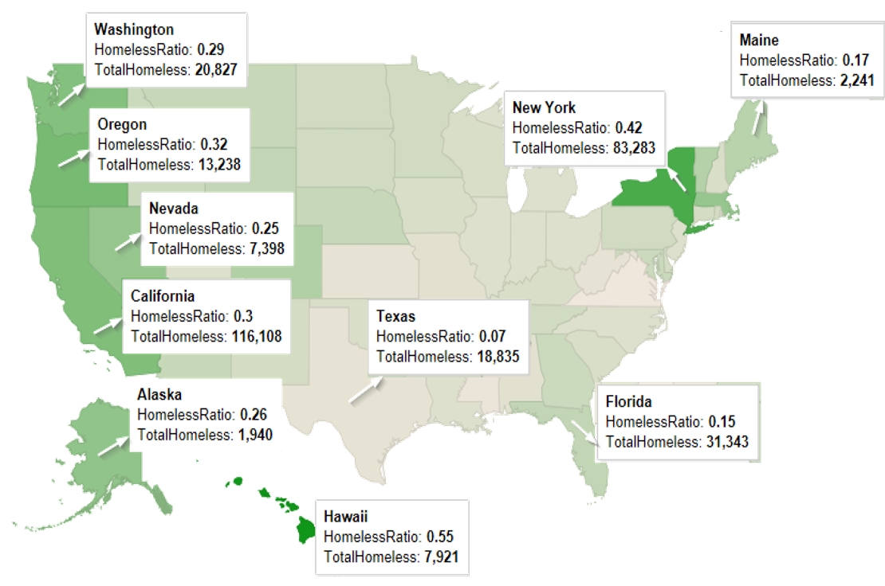

```{r setup, include=FALSE}
knitr::opts_chunk$set(echo = TRUE)
```

```{r, echo=FALSE, message=FALSE}
require(dplyr)
require(stringr)
require(stringi)
require(caret)
require(ggmap)
require(ggplot2)

#function definition to extract from string
substrRight <- function(x, n){
  substr(x, nchar(x)-n+1, nchar(x))
}
```

## Homelessness in United States - A Study

This is an analysis done primarily using R on a public dataset on homelessness across United States, downloaded from HUD website. For the scripts / datasets, please visit <https://github.com/susub31/EARL-Boston2017-Presentation>.

When we think of Hawaii, we tend to think it is one of the most beautiful vacation spots and a must-see place in your lifetime.  And, needless to say that we know it is one of the most expensive places too.  But, did you know that in the year 2016, 7900+ were reported as homeless in the state of Hawaii? Well, the actual count of homeless people in Hawaii may not be anywhere near what it is in California or New York.  Considering the percentage of people who are homeless relative to the population in the state, Hawaii tops the list.  Hawaii has the highest homeless ratio (number of homeless people relative to the State's population) in the country.

### Null Hypothesis
H~0~ = Our Tax Dollars are spent effectively and distributed well.

### Homeless Ratio Map


## Homeless Counts
“Point-in-time” surveys are taken periodically to track counts of homeless people periodically.  This information is very useful to understand spread of homelessness across all States.  It also feeds information to the Department of Housing and Urban Development to determine funding for cities and other initiatives that need to be taken to reduce homelessness.

### Datasets for this analysis:
* Homeless Data 2016 (from HUD)
* US States (for map)

### Data Preparation:
Data Preparatory work has already been done on the original dataset to include lat/lon details across for all counties / cities.  This is required in order to project the details on homeless counts across different states on the map.  The saved information is used for this analysis.

### Insights:
Initial analysis done on the dataset shows different categories of homeless people such as counts of adults, veterans and youth.  This is further categorized as sheltered, unsheltered, critically homeless etc., to name a few.  The following section of code groups the counts by the state so that we can get overall homeless counts in each state across US.  We build this dataset and categorize them as 'Low', 'Medium' and 'High' based on the homeless counts.

```{r message=FALSE, warning=FALSE}
# Read the dataset that holds Homeless Data for 2016
hdata <- read.csv("../Datasets/HomelessData2016.csv", stringsAsFactors = FALSE)

# Read the dataset that holds the extracted values of Lat and Lon for the CoCs
modhdata <- read.csv("../Datasets/HomelessData2016_With_LatLon.csv", stringsAsFactors = FALSE)
modhdata$Total.Homeless..2016 = NULL
modhdata$CoC.Name=NULL

# Merge the datasets and extract the desired columns; rename the columns
alldata <- merge(hdata, modhdata, by.x ="CoC.Number", by.y="CoC.Number")
alldata <- select(alldata, CoC.Number, CoC.Name, cityname, lat, lon, Total.Homeless..2016, 
                  Homeless.Veterans..2016, Homeless.Unaccompanied.Youth..Under.25...2016) %>%
  rename(TotalHomeless = Total.Homeless..2016, HomelessVeterans = Homeless.Veterans..2016, 
         HomelessYouth = Homeless.Unaccompanied.Youth..Under.25...2016)

# The following conversion is required to get the numeric value for the homeless counts
alldata$TotalHomeless <- as.numeric(gsub(",","", alldata$TotalHomeless))
alldata$HomelessVeterans <- as.numeric(gsub(",", "", alldata$HomelessVeterans))
alldata$HomelessYouth <- as.numeric(gsub(",", "", alldata$HomelessYouth))

# Extract the lat/lon coordinates pertaining to mainland US
# http://en.wikipedia.org/wiki/Extreme_points_of_the_United_States#Westernmost
top = 49.3457868 # north lat
bottom =  24.7433195 # south lat
left = -124.7844079 # west long
right = -66.9513812 # east long

#select for states in continous United States
contusdata <- alldata %>% 
  filter(lat > 24 & lat < 50) %>% 
  filter(lon < -66 & lon > -124)

#Include a column to capture "State" from CoCNumber
contusdata$State = substr(contusdata$CoC.Number,1,2)

# Load US States dataset for generating the map
us <- map_data("state")
usstates <- read.csv("../Datasets/StateNames.csv")
usstates <- usstates %>%
  add_rownames("region") %>%
  mutate(region=tolower(StateName))

# Merge US States and Cost of Living by cities datasets for color-coding the US Map
usstates$StateName=NULL
usstates <- merge(usstates, contusdata, by.x="State", by.y="State")

# Group by and get totals by state in each category
CountsByState <- usstates %>% 
  group_by(State, region) %>% 
  summarize(TotalHomeless = sum(TotalHomeless), HomelessVeterans = sum(HomelessVeterans), HomelessYouth = sum(HomelessYouth)) 

CountsByState$Count.Category <- ifelse(CountsByState$TotalHomeless > 20000, "HIGH", ifelse(CountsByState$TotalHomeless > 10000, "MEDIUM", "LOW"))
```

\newpage
### Categories based on Homeless Counts
#### Category - HIGH
States with homeless counts above 20K are categorized as "HIGH" (only 5 states)

```{r cache=FALSE, warning=FALSE, message=FALSE}
CountsByState %>% filter(Count.Category=="HIGH") %>% arrange(desc(TotalHomeless))
```

#### Category - MEDIUM
States with homeless counts above 10K and below 20K are categorized as "MEDIUM" (only 7 states)

```{r cache=FALSE, warning=FALSE, message=FALSE}
CountsByState %>% filter(Count.Category=="MEDIUM") %>% arrange(desc(TotalHomeless))
```

#### Category - LOW
States with homeless counts below 10K are categorized as "LOW" (majority of the states)

```{r cache=FALSE, warning=FALSE, message=FALSE}
CountsByState %>% filter(Count.Category=="LOW") %>% arrange(desc(TotalHomeless))
```

### Density Map of Homeless Counts
Density map based on homeless counts across the states - captures variation in number across the three categories 
\n 
```{r cache=FALSE, warning=FALSE, message=FALSE}
ggplot(CountsByState, aes(x=TotalHomeless)) +
  geom_density() 

```

\newpage
### Density Map of Homeless Counts - by Category
A faceted view - distribution in each of these three categories
\n
```{r cache=FALSE, warning=FALSE, message=FALSE}
ggplot(CountsByState, aes(x=TotalHomeless)) +
  geom_density() +
  facet_wrap(~ Count.Category)

```

\newpage
### Color-coded map of Homeless Counts
States in US map - color coded based on homeless counts (base map for the visualizations)
\n

```{r cache=FALSE, warning=FALSE, message=FALSE}
#Plot a blank US Map
BlankUSMap <- ggplot()
BlankUSMap <- BlankUSMap + geom_map(data=us, map=us, aes(x=long, y=lat, map_id=region), 
                                    fill="white", color="black")

#US Map, color coded based on the total homeless counts in the state
HomelessMap <- BlankUSMap + geom_map(data=CountsByState, map=us, 
                                aes(fill=TotalHomeless, map_id=region), color="#ffffff", size=0.15) 

HomelessMap <- HomelessMap + scale_fill_continuous(low='lightgrey', high='blue', guide='colorbar')
HomelessMap <- HomelessMap + labs(x=NULL, y=NULL) + 
  theme(panel.border = element_blank()) + 
  theme(panel.background = element_blank()) +
  theme(axis.ticks = element_blank()) + 
  theme(axis.text = element_blank()) 

HomelessMap
```
### Inference
Here is what we can infer from this map:

* The map shows extent of homelessness across different states
* California and New York have very high counts of homeless people
* There are quite a few states in the 'medium' and 'low' categories

\n 

\newpage
### Continuum of Care (CoC)
The Continuum of Care (CoC) Program is designed to promote communitywide commitment to the goal of ending homelessness; provide funding for efforts by nonprofit providers, and State and local governments to quickly rehouse homeless individuals and families while minimizing the trauma and dislocation caused to homeless individuals, families, and communities by homelessness.

### Homeless Counts (Adults) - Top 100
Map of top 100 continuums with high homeless counts (size of bubble proportionally to count)

```{r message=FALSE, warning=FALSE, cache=FALSE}
# select top 100 based on homeless counts - adults
hdatatop100 <- tbl_df(subset(alldata, !((substr(alldata$CoC.Number,1,2) =="HI")) & !((substr(alldata$CoC.Number,1,2) =="PR")) )) %>%
  top_n(100, TotalHomeless)

Top100HomelessAdultsMap <- HomelessMap +
  geom_point(aes(x=lon, y=lat, size=TotalHomeless, colour="red", alpha=0.8), data=hdatatop100) + 
  ggtitle("Homeless Counts - Adults (Top 100)") +
  scale_size_continuous(name="Homeless Counts", range = c(2,12), guide = FALSE) +
  scale_alpha(guide=FALSE) +
  scale_colour_discrete(guide=FALSE) 
  
Top100HomelessAdultsMap
```

### Inference
We can infer the following:

* NY and CA have continuums with very high homeless counts
* 24 out of 100 continuums in top 100  list are in California
* Florida also has 9 continuums in the top 100 list

\n

\newpage
### Homeless Counts (Veterans) - Top 100
Map of top 100 continuums with high homeless counts among veterans (size of bubble proportional to count)

```{r message=FALSE, warning=FALSE, cache=FALSE}
# select top 100 based on homeless counts - veterans
hvetsdatatop100 <- tbl_df(subset(alldata, !((substr(alldata$CoC.Number,1,2) =="HI")) & !((substr(alldata$CoC.Number,1,2) =="PR")) )) %>%
  top_n(100, HomelessVeterans)

Top100HomelessVeteransMap <- HomelessMap +
  geom_point(aes(x=lon, y=lat, size=HomelessVeterans, colour="red", alpha=0.8), data=hvetsdatatop100) + 
  ggtitle("Homeless Counts - Veterans (Top 100)") +
  scale_size_continuous(name="Homeless Counts", range = c(2,12), guide = FALSE) +
  scale_alpha(guide=FALSE) +
  scale_colour_discrete(guide=FALSE) 

Top100HomelessVeteransMap
```

### Inference
We can infer the following:

* Los Angles County tops the list in number of homeless veterans
* 21 continuums in top 100 are in California 
* Florida has 11 continuums in the top 100 list


\newpage
### Homeless Counts (Youth) - Top 100
Map of top 100 continuums with high homeless youth counts (size of bubble proportional to count)

### Inference
We can infer the following:

* Los Angles County tops the list 
* 23 continuums in top 100 are in California 
* Florida has 10 continuums in the top 100 list


```{r message=FALSE, warning=FALSE, cache=FALSE}
hyouthdatatop100 <- tbl_df(subset(alldata, !((substr(alldata$CoC.Number,1,2) =="HI")) & !((substr(alldata$CoC.Number,1,2) =="AK")) & !((substr(alldata$CoC.Number,1,2) =="PR")) )) %>%
  top_n(100, HomelessYouth)

Top100HomelessYouthMap <- HomelessMap +
  geom_point(aes(x=lon, y=lat, size=HomelessYouth, colour="red", alpha=0.8), data=hyouthdatatop100) + 
  ggtitle("Homeless Counts - Youth (Top 100)") +
  scale_size_continuous(name="Homeless Counts", range = c(2,12), guide = FALSE) +
  scale_alpha(guide=FALSE) +
  scale_colour_discrete(guide=FALSE) 

Top100HomelessYouthMap
```

\newpage
## Grants vs. Homeless Counts - An analysis
### HUD Exchange Grants
HUD grantees receive funding from HUD to support HUD's mission to create strong, sustainable, inclusive communities and quality affordable homes for all.  HUD grantees include state and local governments, non-profit and for-profit organizations, public housing authories, and tribal entities. 

Some of the HUD exchange grantees include: 

* CDBG - Community Development Block Grant Program
* ESG - Emergency Solutions Grants Program
* HOME Investment Partnerships Program
* HOPWA - Housing Opportunities for Persons with AIDS Program

The Grants Dataset include grant amounts allocated to the respective counties for the year 2016.  For purpose of this analysis, the total grant amount is calculated and used to map against homeless counts in these counties.

### Grants Dataset for Analysis
The Grants Dataset (with geocodes for mapping) is read in.  Analysis is done on data points in mainland US, excluding details for Hawaii, Puerto Rico etc.  Data pertaining to top 'n' (in this example, top 25 are
selected) extracted for both the homeless counts dataset and grants dataset for performing a comparative analysis.  

### COL Index and Impact on Homelessness
One of the key factors that correlate very strongly with homeless counts is "Cost Of Living".  Cities with high cost of living (COL) index is seen to have very high homeless counts.  Further breakdown of COL Index shows that "Housing Costs" attribute to close to 30%.  The top cities with high homeless counts have housing costs much higher than national average. 

### Base Map for Visualization
A dataset of Cost of Living index, applicable in 2016 is used for this analysis.  The cost of living (COL) index values are used to color-code the US map.  With this, it is possible to see how the homelessness correlates to the cost of living index values

```{r message=FALSE, warning=FALSE, cache=FALSE}

#Read Grants dataset
GrantsDS <- read.csv("../Datasets/GrantDSWithGeoCodes.csv") 
GrantsDStop35 <- tbl_df(GrantsDS) %>% 
  top_n(35, TOT_AMT)
GrantsDStop35 <- subset(GrantsDStop35, !(STUSAB == "PR"))

AllGrantsDStop25 <- group_by(GrantsDS, round(lat, 2)) %>% mutate(sum(TOT_AMT))

AllHomelessTop25 <- tbl_df(subset(alldata, !((substr(alldata$CoC.Number,1,2) =="HI")) & !((substr(alldata$CoC.Number,1,2) =="PR")) )) %>%
  top_n(25, TotalHomeless)
GrantsDStop25 <- tbl_df(subset(GrantsDS, !((substr(GrantsDS$STUSAB,1,2) =="HI")) & !((substr(GrantsDS$STUSAB,1,2) =="PR")) )) %>% 
  top_n(25, TOT_AMT)


us <- map_data("state")
usstates <- read.csv("../Datasets/StateNames.csv")
usstates <- usstates %>%
  add_rownames("region") %>%
  mutate(region=tolower(StateName))

COLByCities <- read.csv("../Datasets/COL_ByCities.csv")
COLByCities$UrbanArea <- gsub(", ", " ", COLByCities$UrbanArea)
COLByCities$State <- COLByCities$UrbanArea
COLByCities$State <- substrRight(COLByCities$State, 2)

usstates$StateName=NULL
usstates <- merge(usstates, COLByCities, by.x="State", by.y="State")

COLByCities <- group_by(COLByCities, State)
COLByCities <- summarise(COLByCities, COLStateAvg=mean(COLIndex), HousingIndex=mean(Housing))

COLMap <- BlankUSMap + geom_map(data=usstates, map=us, 
                                aes(fill=Housing, map_id=region), color="#ffffff", size=0.15) 

COLMap <- COLMap + scale_fill_continuous(low='lightgray', high='lightblue', guide='colorbar')

COLMap <- COLMap + labs(x=NULL, y=NULL) + 
  theme(panel.border = element_blank()) + 
  theme(panel.background = element_blank()) +
  theme(axis.ticks = element_blank()) + 
  theme(axis.text = element_blank())

GrantsAndCountsmap <- COLMap + 
  geom_point(aes(x=lon, y=lat, size=TOT_AMT, colour="Total Grants", alpha=0.8), data=GrantsDStop25) + 
  geom_point(aes(x=lon, y=lat, size=TotalHomeless, colour="Homeless Counts", alpha=0.8), data=AllHomelessTop25) + 
  labs(x='Longitude', y='Latitude') +
  ggtitle("Homeless Counts vs. Grants") +
  scale_alpha(guide=FALSE) +
  theme(legend.position="none")

GrantsAndCountsmap <- GrantsAndCountsmap + labs(x=NULL, y=NULL) + 
  theme(panel.border = element_blank()) + 
  theme(panel.background = element_blank()) + 
  theme(axis.ticks = element_blank()) + 
  theme(axis.text = element_blank()) +
  theme(legend.position = "none")

GrantsAndCountsmap
```

### Inference

* Disparity between where we see top homeless counts and where top grants are allocated
* 12 states that appear in the top 25 list of homeless grants, which do not have even one continuum appearing in the top 25 list of high homeless counts


## Summary of the Analysis
Data shows disparity between homeless counts and grant allocation, which is quite substantial.  Around 12 states which appear in top 25 list of grantees do not have county which appear in the top 25 counties with high homeless counts.  So, this 'nullifies' our NULL Hypothesis.

Also, states such as Deleware and Idaho see a continuous increase in homeless counts EVERY year for the past five years.  A data-driven solution can help provide a better solution to stop this increasing tredn in these continuums.

### What next?
Further analysis can be done to identify various factos including housing costs, weather, tourism, employment opportunities etc. across the cities / counties to understand where the grant amounts can provide best returns through reducing homeless counts.

For example, some states showed a decrease in homeless counts, but costs associated were much higher than previous year.  Analysis showed that costs involved for supporting families is much higher than same number of individuals.  So, using data, the focus can be shifted to support families and then individuals.

The Time-Series Analysis helps to predict homeless counts in a state based on data from past years.  By obtaining more granular data (counts by each month), more value could be extracted from the time-series model by way of performing predictions taking into account seasonal impacts etc.  These models can be used by CoCs to predict how many homeless people (by category) they can expect, that they can use in requesting appropriate grant allocation.
